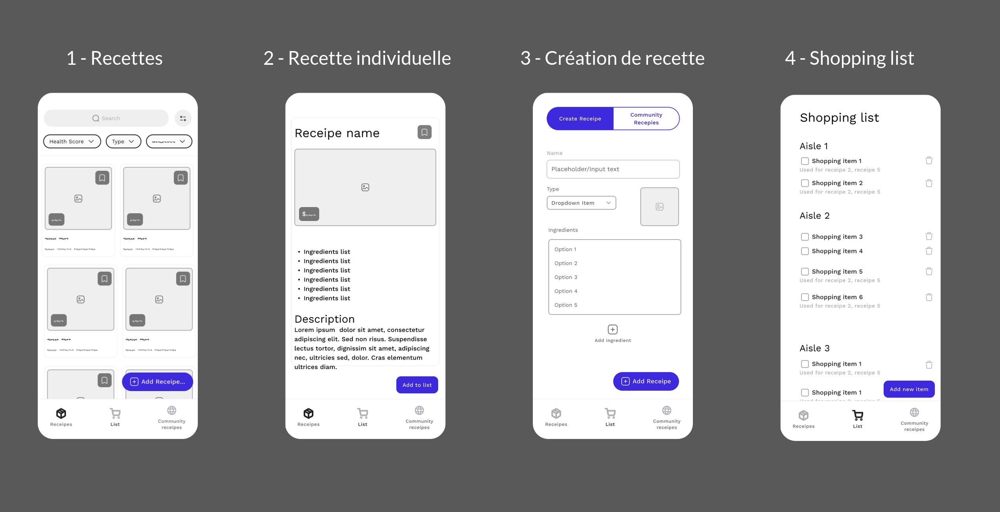

# recipes-app
Work in progress

Un projet React Native simple en Typescript pour la création de recettes personnalisées et la génération d'une liste de courses intelligente à partir de celles ci.

## Fonctionnalités
- Affichage de cartes de recettes
- Recettes communautaires
- Liste de courses intelligente et efficace
- Thème sombre avec inversion de couleurs

## Installation
1. Cloner le dépôt
2. Installer les dépendances avec `yarn`
3. Lancer le projet avec `yarn start`
